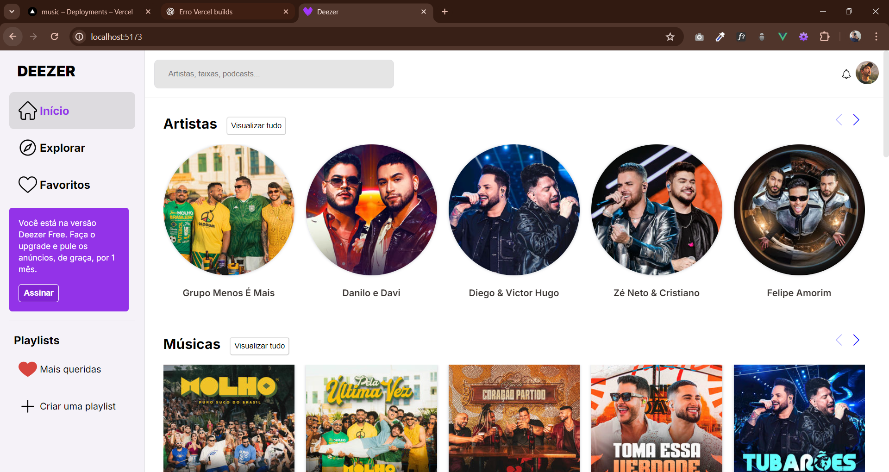

# ShowMusics 🎵

[](https://vuejs.org/)
[](https://vitejs.dev/)
[](https://sass-lang.com/)
[](https://developers.deezer.com/api)
[](https://genius.com/developers)

Aplicativo web para buscar e ouvir **músicas, artistas, álbuns, playlists e podcasts**.  
Inclui player de prévia, favoritos, letras de músicas e modo escuro.

---

## 🌟 Features

- 🔍 Busca por artistas, faixas, álbuns, playlists e podcasts
- 🎧 Player de prévia com play/pause e persistência da última música
- ❤️ Favoritar músicas e artistas (armazenado em `localStorage`)
- 📝 Letras de músicas com refrões destacados em negrito
- 🌙 Modo escuro
- 💬 Notificações de novos lançamentos e recomendações
- ⏳ Skeleton loading para letras
- 🔄 Paginação / infinite scroll para listas grandes
- 🔽 Ordenação nos favoritos (recentes/alfabético)

---

## 🖼 Screenshots

  
_Home com busca e listas de músicas_

  
_Player de prévia e letras em destaque_

  
_Lista de músicas favoritas com ordenação_

---

## 💻 Tecnologias

- [Vue 3](https://vuejs.org/)
- [Vite](https://vitejs.dev/)
- [SCSS](https://sass-lang.com/) com `@use` modular
- [Deezer API](https://developers.deezer.com/api)
- [Genius API](https://genius.com/developers)

---

## ⚙️ Setup

1. Clone o repositório:

```bash
git clone https://github.com/seu-usuario/showmusics.git
cd showmusics
```

2. Instale as dependências:

```bash
npm install
```

3. Crie um arquivo `.env` na raiz do projeto com sua chave da Genius API:

```
VITE_GENIUS_API_KEY=sua_chave_aqui
```

4. Inicie o servidor de desenvolvimento:

```bash
npm run dev
```

5. Inicie o servidor da api:

```bash
npm run dev:api
```

6. Acesse `http://localhost:5173` no seu navegador.

7. Para buildar para produção:

```bash
npm run build
```

8. Para pré-visualizar a build:

```bash
npm run preview
```