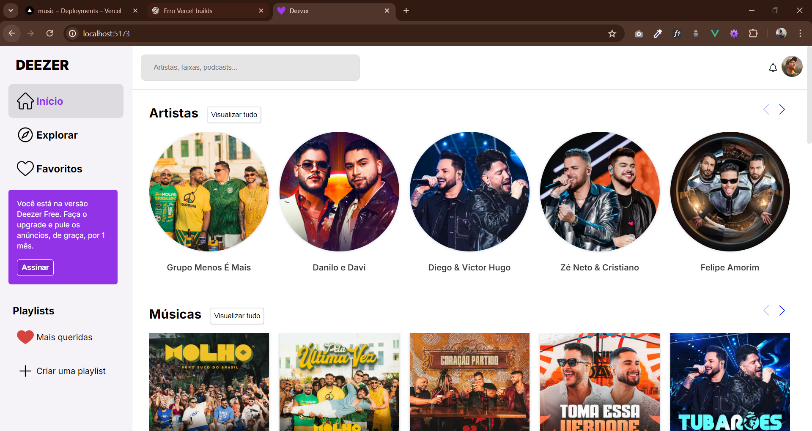
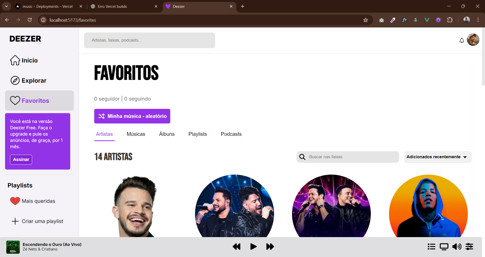

# ShowMusics 🎵

Aplicação web desenvolvida com **Vue.js** para explorar o universo da música através da **Deezer API**, permitindo pesquisar e navegar por músicas, artistas, álbuns, playlists, podcasts e gêneros musicais.

O projeto também conta com **player de prévias**, sistema de **favoritos**, integração com **Genius** para consulta de letras e uma interface inspirada em plataformas modernas de streaming.

[](https://vuejs.org/)
[](https://vite.dev/)
[](https://sass-lang.com/)
[](https://expressjs.com/)
[](https://developers.deezer.com/api)

---

## 🎵 Sobre o projeto

O **ShowMusics** foi desenvolvido para praticar e aplicar conceitos de desenvolvimento Front-End utilizando Vue.js, consumo de APIs, gerenciamento de estado da interface, componentes reutilizáveis e responsividade.

A aplicação utiliza a **Deezer API** para obter informações sobre músicas e artistas e a **Genius API** para consulta de letras.

O projeto possui uma arquitetura com **Front-End em Vue/Vite** e um **servidor Node.js com Express** responsável por intermediar algumas requisições às APIs externas.

---

## ✨ Funcionalidades

### 🔎 Exploração e busca

* Busca por músicas
* Busca por artistas
* Busca por álbuns
* Busca por playlists
* Busca por podcasts
* Exploração de gêneros musicais
* Página de detalhes para músicas, artistas, álbuns e playlists
* Navegação entre artistas, músicas e álbuns relacionados
* Página de artistas, músicas, playlists e podcasts favoritos

### 🎧 Player

* Reprodução de prévias das músicas
* Play e pause
* Controle de progresso
* Navegação entre músicas
* Fila de reprodução
* Player fixo na parte inferior da aplicação
* Reprodução sequencial de prévias
* Reprodução aleatória
* Informações da música atualmente reproduzida

### ❤️ Favoritos

Sistema de favoritos utilizando `localStorage`.

É possível favoritar:

* ❤️ Músicas
* ❤️ Artistas
* ❤️ Álbuns
* ❤️ Playlists
* ❤️ Podcasts

Os favoritos permanecem salvos mesmo após fechar ou recarregar a aplicação.

A interface também identifica visualmente os itens que já estão favoritados.

### 🎤 Letras

* Consulta de letras através da LRCLIB 
* Integração entre música e artista para realizar a busca
* Busca automática de letras
* Exibição das letras na aplicação

### 🎼 Gêneros

* Lista de gêneros musicais
* Carousel de gêneros na página inicial
* Página com todos os gêneros disponíveis
* Página específica para cada gênero
* Playlists relacionadas ao gênero
* Artistas relacionados ao gênero
* Álbuns relacionados ao gênero
* Lançamentos relacionados ao gênero

### 🎨 Interface

* Interface baseada em componentes Vue
* Carousels utilizando Swiper
* Navegação através de Vue Router
* Tema escuro
* Skeleton loading
* Cards para músicas, artistas, álbuns e playlists
* Layout adaptado para diferentes tamanhos de tela
* Feedback visual para interações do usuário

## 🔮 Próximas melhorias

- [ ] Aprimorar a responsividade em todas as páginas
- [ ] Melhorar o sistema de reprodução do player
- [ ] Aprimorar a experiência de busca
- [ ] Melhorar carregamento e tratamento de erros
- [ ] Evoluir a integração com letras sincronizadas
- [ ] Expandir funcionalidades do sistema de favoritos
- [ ] Melhorar acessibilidade
- [ ] Otimizar desempenho

---

## 🖼️ Screenshots

### 🏠 Home



Página inicial com gêneros, músicas e conteúdos em destaque.

### 🎵 Música


Página de detalhes da música com informações e letras.

### ❤️ Favoritos



Página com os conteúdos salvos pelo usuário.

---

## 🛠️ Tecnologias

### Front-End

* [Vue.js](https://vuejs.org/) — construção da interface
* [Vite](https://vite.dev/) — ambiente de desenvolvimento e build
* [Vue Router](https://router.vuejs.org/) — gerenciamento das rotas
* [Swiper](https://swiperjs.com/) — carousels
* [Axios](https://axios-http.com/) — requisições HTTP
* [SCSS](https://sass-lang.com/) — estilização e organização dos estilos

### Back-End

* [Node.js](https://nodejs.org/) — ambiente de execução
* [Express.js](https://expressjs.com/) — servidor e rotas da API
* [CORS](https://developer.mozilla.org/en-US/docs/Web/HTTP/CORS) — comunicação entre aplicações
* [dotenv](https://www.npmjs.com/package/dotenv) — gerenciamento de variáveis de ambiente

### APIs

* [Deezer API](https://developers.deezer.com/api) — músicas, artistas, álbuns, playlists e gêneros
* [LRCLIB](https://lrclib.net/) — busca de letras

---

## 📁 Estrutura do projeto

```text
showmusics/
├── api/
│   └── deezer/
│   └── lyrics/
│
├── src/
│   ├── assets/
│   │   ├── icons/
│   │   └── images/
│   │   └── scss/
│   │
│   ├── components/
│   │   ├── Header.vue
│   │   ├── Sidebar.vue
│   │   ├── Footer.vue
│   │   ├── Genres.vue
│   │   ├── AllGenres.vue
│   │   ├── DetailsGenre.vue
│   │   └── ...
│   │
│   ├── services/
│   │   └── api.js
│   │
│   ├── untils/
│   │   ├── formatDate.js
│   │   ├── formatNumber.js
│   │   ├── formatDuration.js
│   │   └── formatHours.js
│   │   └── getGenreColor.js
│   │
│   └── ...
│
│
├── package-lock.json
├── package.json
├── README.md
├── server.js
├── vercel.json
├── vite.config.js
```

---

## ⚙️ Instalação

### 1. Clone o repositório

```bash
git clone https://github.com/Vinicius-Boschi/music.git
```

Entre na pasta:

```bash
cd music
```

### 2. Instale as dependências

```bash
npm install
```

### 3. Configure as variáveis de ambiente

Crie um arquivo `.env` na raiz do projeto.

No ambiente de produção, configure também a URL da API utilizada pelo Front-End:

```env
VITE_API_BASE=https://sua-api.com
```

> As variáveis de ambiente podem variar de acordo com o ambiente de desenvolvimento ou produção.

---

## ▶️ Executando o projeto

### Front-End

Execute o Vite:

```bash
npm run dev
```

A aplicação estará disponível normalmente em:

```text
http://localhost:5173
```

### API

Em outro terminal, execute o servidor Express:

```bash
npm run dev:api
```

A API local será executada na porta configurada pelo projeto, normalmente:

```text
http://localhost:3001
```

---

## 📦 Build

Para gerar a versão de produção:

```bash
npm run build
```

Para visualizar a build localmente:

```bash
npm run preview
```

---

## 🔌 API

O projeto utiliza o servidor Express como intermediário para algumas requisições externas.

## 🔮 Próximas melhorias

- [ ] Aprimorar a responsividade em todas as páginas
- [ ] Arrumar data de música adicionada
- [ ] Melhorar carregamento e tratamento de erros
- [ ] Evoluir a integração com letras sincronizadas
- [ ] Expandir funcionalidades do sistema de favoritos
- [ ] Melhorar acessibilidade
- [ ] Otimizar desempenho

As requisições para a Deezer são encaminhadas através da rota:

```text
/api/deezer/*
```

Exemplo:

```text
/api/deezer/chart/0/tracks
```

### Genius

A consulta de letras utiliza:

```text
https://lrclib.net/api/search?
```

com os parâmetros necessários para realizar a busca da música e do artista.

---

## 💾 Armazenamento de favoritos

Os favoritos são armazenados no navegador utilizando localStorage.

As categorias utilizadas são:

favorites_artists
favorites_tracks
favorites_albuns
favorites_playlists
favorites_podcast

Dessa forma, os itens favoritados continuam disponíveis mesmo após atualizar ou fechar a aplicação.

 ## 👨‍💻 Autor

**Vinícius Boschi**